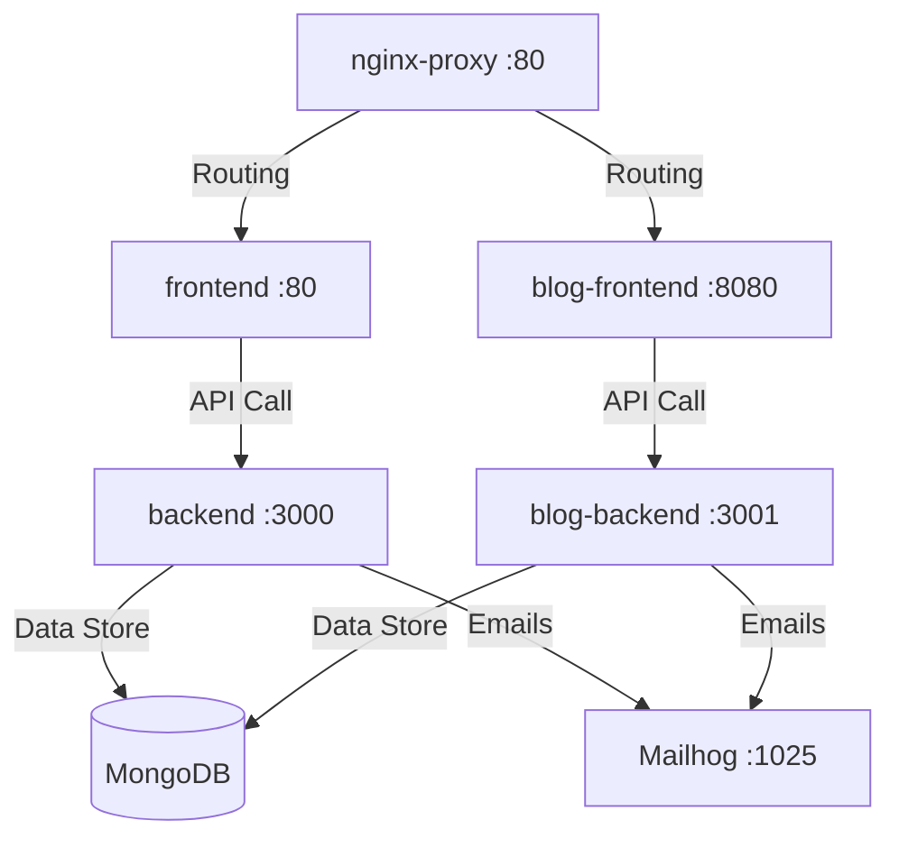

# 📸 Chambre Noire 📸

[](https://github.com/jacnux/Chambre-Noire)
[](#)
[](#)
[](#)

> **Chambre Noire** est un carnet de prise de vue et une mémoire technique & artistique pour les photographes amateurs et professionnels pratiquant la photographie argentique et numérique. Il permet de documenter les conditions de prise de vue, de cataloguer son matériel photo, de suivre les bains de développement et d'exposer ses projets sous forme de récits visuels ("Carnet de routes").

---

## 🎨 Composants du Projet

Le projet s'organise autour d'une architecture micro-services orchestrée par Docker Compose :



> **Note** : les services `blog-frontend` / `blog-backend` (§3, « Carnet de Routes »)
> ne font pas partie de **ce dépôt** — ils sont hébergés dans un dépôt séparé et
> se branchent sur la même base MongoDB et le même backend.

### 🖥️ 1. API & Backend Core (`backend`)
* API Node.js/Express en TypeScript. Elle extrait automatiquement les métadonnées **EXIF** (modèle d'appareil photo, objectif, ouverture, ISO, temps d'exposition) des fichiers importés.
* Intègre la gestion des modèles pour le matériel, les pellicules, les projets artistiques et les photos.

### ⚙️ 2. Tableau de Bord Administrateur (`frontend`)
* Interface en React qui permet au photographe de gérer sa collection :
  * **Matériel** : Enregistrement de ses boîtiers et objectifs.
  * **Films** : Catalogue de ses pellicules préférées (ISO, marque, format).
  * **Projets** : Regroupements artistiques de clichés avec description d'intention.
  * **Éditeur de Photos** : Association d'une photo à un projet, avec saisie des paramètres d'exposition et des bains de développement chimiques (révélateur, dilution, température, temps, agitation).

### 📖 3. Rendu Public - Carnet de Routes (`blog-frontend` & `blog-backend`)
* Espace de lecture public permettant de consulter les projets publiés.
* Les photos y sont présentées dans un format narratif épuré avec des fiches techniques interactives révélant les coulisses de la création de chaque image.

---

## ⚡ Fonctionnalités Clés

* 📓 **Mémoire Artistique & Technique** : Saisissez l'intention artistique derrière chaque image, la date, le lieu, ainsi que la chimie de développement pour l'argentique.
* 📸 **Extraction EXIF & Appariement Automatique** : Lit les métadonnées de l'image au téléversement et associe automatiquement le cliché au boîtier ou à l'objectif correspondant dans votre inventaire.
* 🧪 **Suivi de la Chimie Argentique** : Enregistrez le révélateur, sa dilution, le temps de développement, la température et l'agitation appliqués.
* 📁 **Gestion de Projets** : Regroupez vos photographies dans des portfolios thématiques ("Carnet de routes") à publier sur le web.

---

## 🚀 Démarrage Rapide

### Prérequis
* **Docker** et **Docker Compose** installés.

### 1. Configuration des variables d'environnement
Créez un fichier `.env` à la racine et configurez les variables d'environnement nécessaires :

```env
# --- Base de données ---
MONGO_URI=mongodb://mongo:27017/chambrenoire

# --- API & Sécurité ---
JWT_SECRET=votre_secret_jwt_super_securise
NODE_ENV=production
PUBLIC_URL=https://chambrenoire.local
REACT_APP_API_URL=https://api.chambrenoire.local

# --- Infrastructure ---
NGINX_PORT=80
```

### 2. Lancement des Services
Pour construire et démarrer l'ensemble des conteneurs :

```bash
docker compose up -d --build
```

---

## 🤝 Contribution & Maintenance

Les messages de commit doivent être clairs et rédigés en français :
```bash
git add .
git commit -m "feat(matériel): ajout du support pour le moyen format 120"
git push origin main
```
