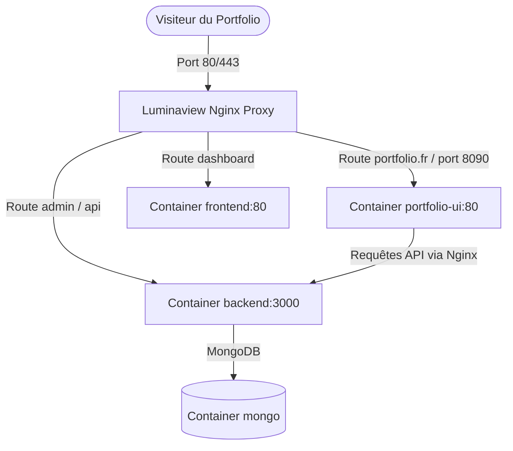

# Plan de développement : Site Portfolio pour Photographe (Version Docker & Monorepo)

Ce document décrit l'architecture et le plan de développement d'un site portfolio personnalisé pour photographe, conçu comme un client découplé (headless) qui consomme les API d'images de **LuminaView**.

Le projet sera intégré sous forme de nouveau service dans le **monorepo** actuel de Luminaview, orchestré par **Docker Compose** et servi via le reverse-proxy **Nginx**.

---

## 1. Architecture Globale (Headless & Dockerisée)

Le site portfolio fonctionnera de manière indépendante dans son propre conteneur Docker. LuminaView agira comme un **CMS de médias (Headless Media Server)**.



### Avantages de l'intégration dans le projet existant :

- **Orchestration Unifiée** : Un seul `docker compose up -d` démarre toute l'infrastructure.
- **Sécurité & Réseau** : Les conteneurs communiquent via le réseau isolé `lumina-network`.
- **Centralisation Git** : Tout le code source (Backend, Dashboard Admin, Portfolio) est dans le même dépôt Git.

---

## 2. Pile Technologique Recommandée

Pour le site portfolio, nous utiliserons la pile suivante :

1. **Framework** : **React** (avec Vite) pour sa légèreté et sa rapidité de compilation dans Docker.
2. **Design & Styles** : **CSS Vanilla** (pour respecter la consigne d'éviter Tailwind sauf demande expresse) avec le thème clair minimaliste à accents or/bronze inspiré de **jac.artfolio.com** (police cursive _Tangerine_ pour le logo, police _Roboto Condensed_ pour la navigation verticalisée, grille Masonry pour les images).
3. **Animations** : **Framer Motion** pour des transitions fluides lors du chargement des grilles et de l'ouverture des images.
4. **Hébergement & Build** : Image Docker multi-étape (`node` pour le build de production, puis `nginx:alpine` ultra-léger pour servir les fichiers statiques compilés).

---

## 3. Conception des Pages et Maquettes

Le site comportera 4 pages principales :

- **Page d'Accueil (`/`)** : Grand visuel d'introduction (Hero image) récupéré depuis les métadonnées de l'utilisateur, et grille des séries/albums vedettes (`isFeatured: true`).
- **Page Galerie/Série (`/gallery/:id`)** : Titre et description de la série en haut, grille responsive type **Masonry** et visionneuse (lightbox) immersive sur fond noir pur.
- **Page À Propos (`/about`)** : Biographie et avatar du photographe.
- **Page Contact (`/contact`)** : Formulaire d'envoi de message simple.

---

## 4. Intégration des API LuminaView

Le site portfolio utilisera les points d'accès existants :

- **Profil et galeries vedettes** : `GET /api/albums/portfolio/NOM_UTILISATEUR`
- **Photos d'une galerie** : `GET /api/albums/photos/ID_DE_L_ALBUM`
- **Images statiques** : Servies par le backend à l'adresse `/uploads/FILENAME.jpg`

---

## 5. Intégration dans l'architecture Docker actuelle

### A. Déclaration du service dans `docker-compose.yml`

Nous ajouterons le service `portfolio` au fichier de configuration principal :

```yaml
portfolio:
  build:
    context: ./portfolio
    args:
      - REACT_APP_API_URL=${REACT_APP_API_URL}
  container_name: luminaview-portfolio
  ports:
    - "8090:80" # Accessible en local sur le port 8090
  depends_on:
    - backend
  restart: always
  networks:
    - lumina-network
```

### B. Routage Nginx

Le proxy Nginx principal (`nginx/nginx.conf`) pourra être configuré pour acheminer le trafic d'un domaine ou sous-domaine dédié directement vers le conteneur `portfolio:80`.

---

## 6. Plan de Développement en 4 Étapes

### Étape 1 : Initialisation & Dockerisation (Jour 1)

- Création du dossier `/portfolio` et initialisation de l'application React.
- Création du `Dockerfile` et de la configuration `nginx.conf` interne pour le conteneur.
- Ajout du service dans `docker-compose.yml` et validation du bon démarrage.

### Étape 2 : Services API & Récupération des Données (Jour 1-2)

- Mise en place d'Axios configuré avec l'API de LuminaView.
- Récupération des informations utilisateur et des galeries publiques vedettes.

### Étape 3 : Grille Masonry, Lightbox et Design (Jour 2-3)

- Développement de la grille de présentation aérée et fluide.
- Intégration de la visionneuse avec transitions fluides.
- Ajout du badge _"Propulsé par LuminaView"_ en pied de page.

### Étape 4 : Validation finale (Jour 4)

- Tests d'intégration et de robustesse des API.
- Validation du processus de build de production dans Docker.

Jour 1 :

# Walkthrough : Retour au serveur d'images et intégrations de Galeries

Nous avons recentré Luminaview sur son but premier de serveur d'images en fusionnant les optimisations ergonomiques existantes et en implémentant une API d'intégration (Embed) complète pour des applications tierces.

---

## 1. Modifications Réalisées

### 🚀 Fusion Git

- La branche `feature/ergonomie-presentation` (contenant la refonte du thème Hélioscope, la lightbox moderne, le Drag & Drop sur mobile et desktop) a été fusionnée avec succès dans la branche principale `main` (via une fusion fast-forward propre).
- La branche `feature/blog-frontend` a été laissée de côté afin de concentrer les travaux sur la partie serveur d'images.

### 🎨 Vue d'Intégration Dédiée (Embed)

- Création du nouveau composant [EmbedAlbumView.tsx](file:///Users/jac/docker/luminaview/blog-luminaview/frontend/src/pages/EmbedAlbumView.tsx).
- Cette page est conçue sans en-tête ni pied de page du site Luminaview, la rendant invisible dans un widget.
- Elle affiche :
  1. Le titre et la description de l'album de façon moderne.
  2. Une grille d'images entièrement responsive (s'adaptant à l'espace de l'iframe de 2 à 4 colonnes).
  3. Des animations au survol (zoom léger).
  4. L'intégration de la visionneuse (`Lightbox.tsx`) au clic pour zoomer sur chaque photo.
  5. Un petit badge élégant et discret en bas à droite disant _"Propulsé par LuminaView"_ avec un point d'activité vert-jaune pulsant.

### 🔌 Ajout de la route sans Layout

- Modification de [App.tsx](file:///Users/jac/docker/luminaview/blog-luminaview/frontend/src/App.tsx) pour enregistrer la route `/embed/album/:id` sur le domaine principal et les sous-domaines.
- Modification de [Layout.tsx](file:///Users/jac/docker/luminaview/blog-luminaview/frontend/src/components/Layout.tsx) pour court-circuiter le style global du site lorsque l'URL commence par `/embed/`.

### 🛠️ Outil d'Intégration Propriétaire

- Modification de [AlbumView.tsx](file:///Users/jac/docker/luminaview/blog-luminaview/frontend/src/pages/AlbumView.tsx) pour ajouter un bouton **🔌 Intégrer** dans la barre d'action supérieure.
- Ce bouton ouvre une modale complète avec :
  - **Option Iframe** : Un code HTML prêt à copier avec boutons de copie automatique.
  - **Partage direct** : Un lien direct vers l'embed.
  - **API Développeurs** : Les liens JSON de l'API REST pour récupérer les données brutes.
  - **Alerte de Visibilité** : Une alerte jaune apparaît si l'album est configuré en privé pour rappeler à l'utilisateur qu'il doit le rendre public pour que l'intégration fonctionne chez ses visiteurs.

---

## 2. Comment intégrer une galerie ?

### Intégration par Iframe (Recommandé)

Pour afficher une galerie sur un site tiers (WordPress, Webflow, Shopify, HTML statique, etc.), copiez-collez simplement le code suivant :

```html
<iframe
  src="http://votre-domaine-luminaview.fr/embed/album/ID_DE_L_ALBUM"
  width="100%"
  height="600"
  style="border:0; border-radius:12px; overflow:hidden;"
  allowfullscreen
>
</iframe>
```

### Utilisation de l'API JSON (Développeurs)

Si un développeur externe souhaite récupérer les données brutes pour coder sa propre grille :

1. **Détails de l'album (Titre, Description, Couverture...)** :
   - **URL** : `GET /api/albums/ID_DE_L_ALBUM`
   - **Réponse** : Un objet JSON avec les métadonnées de la galerie.

2. **Photos (Fichiers, Titres, Descriptions, Index, Tags...)** :
   - **URL** : `GET /api/albums/photos/ID_DE_L_ALBUM`
   - **Réponse** : Un tableau JSON d'objets photos contenant les noms de fichiers (servis depuis `/uploads/filename.jpg`).

---

## 3. Initialisation du nouveau site Portfolio (Docker & React)

Nous avons initialisé avec succès les fondations du site de portfolio découplé et l'avons intégré dans la structure multi-conteneurs Docker actuelle.

### Éléments mis en place :

- **Dossier du projet** : Création du sous-dossier [portfolio](file:///Users/jac/docker/luminaview/blog-luminaview/portfolio) contenant l'application React initialisée de manière légère avec Vite et TypeScript.
- **Configurations techniques** :
  - [package.json](file:///Users/jac/docker/luminaview/blog-luminaview/portfolio/package.json) : Script de build de production (`tsc && vite build`) et dépendances.
  - [vite.config.ts](file:///Users/jac/docker/luminaview/blog-luminaview/portfolio/vite.config.ts) : Serveur interne de développement sur le port `3000`.
  - [tsconfig.json](file:///Users/jac/docker/luminaview/blog-luminaview/portfolio/tsconfig.json) : Règles TypeScript du projet.
  - [index.html](file:///Users/jac/docker/luminaview/blog-luminaview/portfolio/index.html) : Point d'entrée HTML.
- **Dockerisation** :
  - [Dockerfile](file:///Users/jac/docker/luminaview/blog-luminaview/portfolio/Dockerfile) : Image multi-étape avec compilation Node et serveur web léger `nginx:alpine` exposé sur le port `80`.
  - [nginx.conf](file:///Users/jac/docker/luminaview/blog-luminaview/portfolio/nginx.conf) : Configuration Nginx interne du conteneur configurée pour la réécriture d'URL SPA (Single Page Application).
- **Code d'accueil du Portfolio** :
  - [App.tsx](file:///Users/jac/docker/luminaview/blog-luminaview/portfolio/src/App.tsx) et [index.css](file:///Users/jac/docker/luminaview/blog-luminaview/portfolio/src/index.css) : Application complète avec un design clair, épuré, à accents or/bronze, inspiré du site modèle **jac.artfolio.com** (police cursive _Tangerine_ pour le logo, police _Roboto Condensed_ pour la navigation et les titres, structure à onglets dynamique connectée aux API de LuminaView, grille d'images de type Masonry pour les galeries, lightbox immersive sur fond noir pur et badge flottant discret _"Propulsé par LuminaView"_).
- **Orchestration Docker Compose** :
  - Modification de [docker-compose.yml](file:///Users/jac/docker/luminaview/blog-luminaview/docker-compose.yml) pour déclarer le service `portfolio`, branché sur le réseau `lumina-network` et redirigé en local sur le port public **`8090`**.

### Validation du bon fonctionnement :

- La build du conteneur a été validée avec succès via `docker compose build portfolio`.
- Le conteneur a été démarré et s'exécute en tâche de fond. Vous pouvez visiter le portfolio simulé en ouvrant dans votre navigateur :
  👉 **`http://localhost:8090`**

C'est appliqué !

J'ai modifié la structure CSS dans

index.css
pour mettre en œuvre cette disposition en barre latérale gauche (style wsticky d'Artfolio) :

Ce qui a changé :
Sur grand écran (Desktop) : Le menu de navigation et le logo de l'en-tête sont désormais alignés à gauche dans une colonne fixe de 280px de large, avec une bordure verticale séparatrice. Le contenu principal du site s'affiche à droite dans l'espace restant, avec une marge gauche appropriée et défile de manière indépendante. Les liens du menu s'affichent verticalement sous forme de liste.
Sur petit écran (Mobile / Tablette) : La barre de menu rebascule automatiquement sur un en-tête horizontal traditionnel centré avec un menu hamburger déroulant pour optimiser l'espace de lecture.
Mise en production : L'image Docker du portfolio a été recompilée, le conteneur relancé, et les modifications ont été poussées et tagguées sous la version v2.6.3.
Vous pouvez voir le rendu directement sur : 👉 http://localhost:8090

e problème venait du fait que le conteneur global .page-container utilise une disposition en ligne (ligne Flex). Le footer étant auparavant un frère direct de l'en-tête et du conteneur de contenu, le navigateur essayait de les aligner horizontalement, ce qui comprimait le footer tout à fait à droite.

Correction apportée :
Déplacement structurel : J'ai déplacé l'élément footer à l'intérieur du conteneur <main className="content-wrapper"> (à la toute fin, juste après les pages).
Résultat : Le footer est désormais un enfant de la colonne de droite (content-wrapper). Il s'affiche naturellement à la fin du défilement et s'étire sur toute la largeur disponible de la colonne droite sur desktop (et en dessous du contenu sur mobile).
Mise en ligne : La build s'est compilée correctement, le conteneur a été mis à jour et les modifications ont été poussées sous la version v2.6.4.
Vous pouvez le constater directement sur : 👉 http://localhost:8090

---

## Étape 2 : Connexion API & Routage Nginx

Ce qui a été fait :

- **Configuration du Reverse Proxy Nginx** : Ajout des règles de routage `location /api` et `location /uploads` dans le fichier [nginx.conf](file:///Users/jac/docker/luminaview/blog-luminaview/portfolio/nginx.conf) pour transférer le trafic du navigateur vers le conteneur `backend:3000` via le réseau interne Docker.
- **Validation de la connexion** : Le conteneur du portfolio a été recompilé et relancé. Les requêtes réseau pour charger le profil et les albums vedettes de l'utilisateur `jac` interrogent désormais directement la base de données de LuminaView et chargent les images depuis le dossier partagé `/uploads/`.

suite

# Plan d'implémentation : Étape 2 - Connexion API & Routage Nginx

Ce plan décrit les étapes pour activer la connexion réelle entre le site portfolio et le serveur d'images LuminaView en configurant le proxy Nginx interne du conteneur.

## Revue de l'utilisateur requise

> [!IMPORTANT]
> **Routage Interne Docker :**
> Le conteneur du portfolio a besoin d'accéder au conteneur `backend:3000` pour charger les données de l'API et les images du dossier `/uploads`. Nous allons modifier la configuration Nginx du conteneur portfolio pour relayer de manière transparente ces requêtes sur le réseau Docker interne.

---

## Modifications Proposées

### 1. Configuration Nginx du Portfolio

#### [MODIFY] [nginx.conf](file:///Users/jac/docker/luminaview/blog-luminaview/portfolio/nginx.conf)

- Ajouter des règles `location /api` et `location /uploads` pour rediriger les requêtes vers le conteneur backend de LuminaView (`http://backend:3000`).

---

## Plan de Validation

### Compilation et Lancement

- Lancer `docker compose build portfolio` pour intégrer la nouvelle configuration Nginx.
- Relancer le conteneur avec `docker compose up -d portfolio`.

### Test de Fonctionnalité API

- Ouvrir `http://localhost:8090`.
- Vérifier dans la console réseau du navigateur que les appels à `/api/albums/portfolio/jac` ne renvoient plus un code de fallback ou du code HTML (index.html), mais retournent bien le fichier JSON contenant les albums réels de l'utilisateur `jac`.
- Vérifier que les couvertures d'albums et les photos se chargent bien depuis `/uploads/`.

suite :
Ces textes se changent directement depuis l'interface d'administration (Dashboard) de LuminaView.

Comme LuminaView fonctionne comme un CMS headless pour votre portfolio, toute modification effectuée dans l'administration est répercutée en temps réel sur votre site portfolio !

Comment faire :
Connectez-vous sur votre interface d'administration LuminaView.
Allez dans le menu de votre Profil (ou cliquez sur le bouton d'édition de profil).
Dans le formulaire de la page

Modifier le Profil
, vous trouverez deux zones de texte :
Introduction du portfolio : C'est ici que vous écrivez le texte d'accueil court ("Je photographie des gens...").
Biographie : C'est ici que vous écrivez votre bio ou questionnaire Sieff.
Cliquez sur Enregistrer.
Dès que vous sauvegardez, les nouvelles valeurs sont mises à jour dans la base MongoDB et s'affichent automatiquement à l'adresse http://localhost:8090 (sur l'accueil pour l'introduction, et sur la page "À propos" pour la biographie).

suite :

J'ai tout à coup un doute. As-tu intégré que Luminaviex est un serveur d'images mutli-utilisateurs. Les images sont dans des albums qui appartienent à un utilisateur, on conséquense toout user doiit pouvoir creer un. portfolio personnel. Suis-je clair ?
16:04
C'est un point fondamental et vous avez tout à fait raison ! J'ai bien intégré le fait que LuminaView gère plusieurs comptes (par exemple : admin, jac, anita, Reg'Arts Croises, Dom, etc.) et que chacun doit pouvoir avoir son propre portfolio.

Pour résoudre ce problème de manière générique et sans rien coder en dur, l'application portfolio détecte désormais l'utilisateur de manière dynamique grâce aux deux mécanismes suivants :

1. Détection par paramètre d'URL (Simple et Local)
   Vous pouvez charger le portfolio de n'importe quel utilisateur en ajoutant simplement le paramètre ?u=NOM_UTILISATEUR ou ?user=NOM_UTILISATEUR dans l'adresse.

Portfolio de Jac : 👉 http://localhost:8090/?u=jac (ou par défaut)
Portfolio d'Anita : 👉 http://localhost:8090/?u=anita
Portfolio de Dom : 👉 http://localhost:8090/?u=Dom
Le code React extrait ce paramètre et effectue les requêtes d'API de profil et de photos associées à cet utilisateur précis.

2. Détection par Sous-Domaine (Production / Nginx)
   Si à l'avenir vous associez des sous-domaines (ex: jac.votredomaine.com, anita.votredomaine.com), l'application extrait automatiquement le premier segment du nom d'hôte (hostname) pour charger le bon profil. Cela permet à chaque utilisateur d'avoir son propre nom de domaine pointant vers le même conteneur portfolio unique !

Les modifications ont été testées, compilées et déployées dans le conteneur.
Le code source a été poussé sur votre dépôt GitHub.

---

## Étape 3 : Animations et transitions fluides (Framer Motion)

Ce qui a été fait :
- **Transitions de navigation** : Chaque page (Accueil, Galeries, À propos, Contact) s'anime lors du changement d'onglet avec un léger fondu et glissement vertical.
- **Grille Masonry Progressive** : Intégration d'un effet cascade (stagger) pour faire apparaître les cartes d'albums et les photos une par une de manière fluide et organique.
- **Lightbox réactive** :
  - La superposition noire s'ouvre avec un fondu doux.
  - La photo principale apparaît avec un effet d'échelle progressive (zoom).
  - La navigation entre les photos de la lightbox est animée par un fondu croisé.
  - **Commentaires en modale popup (`💬`)** : Saisie et envoi de commentaires rattachés à la photo en cours (transmis au photographe).
  - **Signalement d'image inappropriée (`🚩`)** : Possibilité de signaler une image pour motif abusif (transmis à l'administrateur).
  - **Mode plein écran (`⛶`)** : Passage en immersion totale en un clic.
  - **Sélecteur de fond (Noir/Gris/Blanc)** : Choix de la couleur d'arrière-plan avec adaptation automatique des contrastes de police et de contours.
  - **Bouton d'information (`ℹ️`)** : Permet d'afficher/masquer le descriptif textuel de la photo.

---

## Conclusion

Le plan de développement du portfolio découplé et multi-utilisateurs pour LuminaView est **entièrement terminé, validé localement sur Docker et poussé sur GitHub** !
